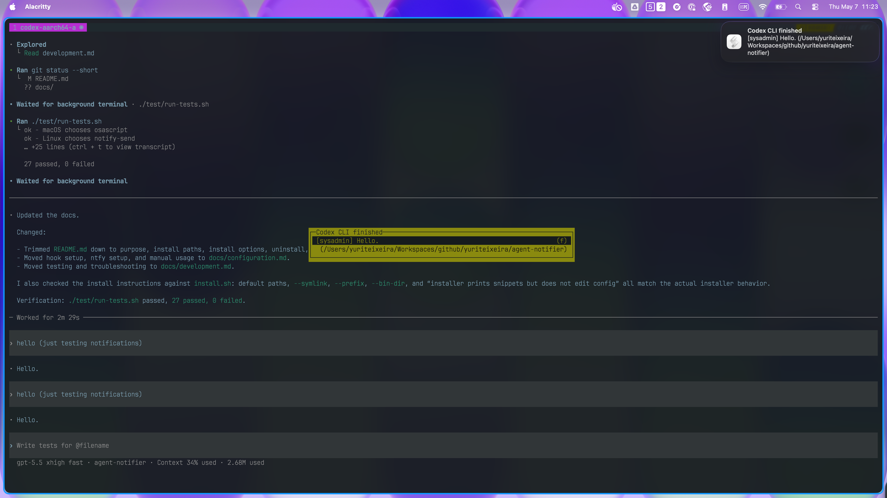

# agent-notifier

Small local notifier for Claude Code, Codex CLI, and Gemini CLI hooks.

It reads hook JSON from stdin and sends best-effort notifications when an agent
finishes a turn or needs user interaction. It supports local desktop
notifications, tmux messages, and optional ntfy publishing.



## Install

```sh
git clone https://github.com/yuriteixeira/agent-notifier.git
cd agent-notifier
./install.sh
```

Default install paths:

```text
~/.local/bin/agent-notifier
~/.local/lib/agent-notifier/
```

The installer prints ready-to-paste hook snippets for Claude Code, Codex CLI,
Gemini CLI, and optional ntfy setup. It does not edit your config files.

Use a symlink install while developing from a clone:

```sh
./install.sh --symlink
```

Install somewhere else:

```sh
./install.sh --prefix /opt/agent-notifier
./install.sh --bin-dir "$HOME/bin"
```

With `--bin-dir`, support modules are installed in a sibling
`lib/agent-notifier/` directory next to the chosen bin directory.

## Uninstall

```sh
./uninstall.sh
```

Then remove any pasted hook snippets from Claude, Codex, Gemini, and ntfy config
files.

## More

- [Configuration](docs/configuration.md)
- [Development and troubleshooting](docs/development.md)

## License

GPLv3. See [LICENSE](LICENSE).

## No Guarantees

This tool is provided as-is and is meant to be a small convenience layer around
agent hooks. It makes a best-effort attempt to notify you, but it cannot
guarantee delivery, timing, privacy, compatibility with every terminal or agent
version, or correct behavior in every local environment.

Use it at your own risk. You are responsible for reviewing the hook snippets you
install, the payloads your agents emit, the notification backends you enable,
and any data that leaves your machine through services such as ntfy.
